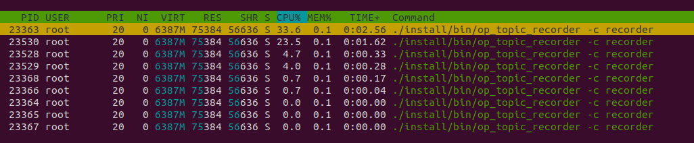
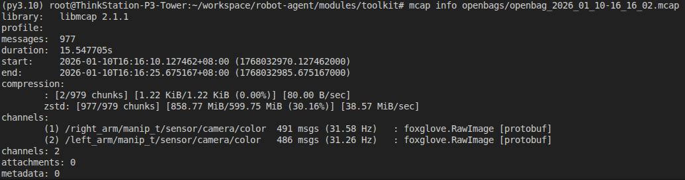
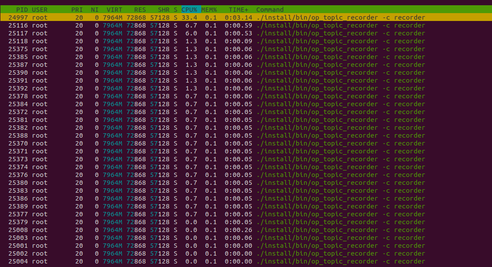
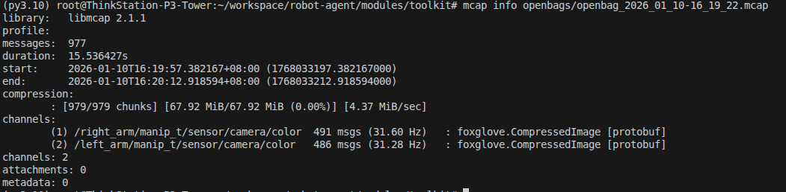
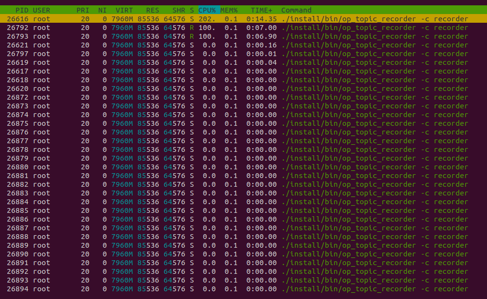
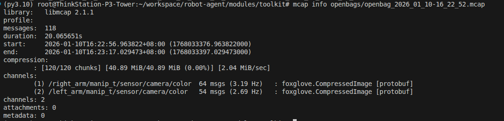

# 图像压缩性能分析

> System Benchmarks: Compression Performance
>
> 本文档提供关于不同压缩策略（Raw vs JPEG vs PNG）在实机录制时的系统性能数据。

## 1. 实验目的
验证在不修改上游发布话题的前提下，录制端使用 `foxglove.CompressedImage`（JPEG/PNG）替代 `foxglove.RawImage` 对系统资源（CPU/磁盘IO）和数据完整性（掉帧率）的影响。

## 2. 实验环境
- **测试话题**：
  - `/right_arm/manip_t/sensor/camera/color` (RGB, 640x480 @ 30Hz)
  - `/left_arm/manip_t/sensor/camera/color` (RGB, 640x480 @ 30Hz)
- **录制配置**：
  - **RawImage**: 仅使用 mcap chunk 级 zstd 压缩。
  - **JPEG**: `foxglove.CompressedImage` (format=jpeg, quality=95) + mcap zstd。
  - **PNG**: `foxglove.CompressedImage` (format=png) + mcap zstd。

## 3. 结果汇总

| 模式 | 右臂频率 | 左臂频率 | mcap 文件体积 (双臂) | CPU 峰值 (单核) |
|---|---:|---:|---|---|
| **RawImage** | 31.58 Hz | 31.26 Hz | ~858 MiB | ~33.6% |
| **JPEG** | **31.60 Hz** | **31.28 Hz** | **~67 MiB** | **~33.4%** |
| **PNG** | 3.19 Hz | 2.69 Hz | ~40 MiB | **100.0%** |

### 3.1 关键发现
1.  **JPEG 性能优异**：JPEG 模式下的录制频率与 RawImage 持平（~31Hz），未出现掉帧。CPU 占用率未显著增加（维持在 33% 左右），说明 JPEG 编码开销在现代 CPU 上完全可控。
2.  **存储收益巨大**：JPEG 模式将文件体积从 858 MiB 降至 67 MiB，**压缩比约 12.8x**（相比 Raw+Zstd）。
3.  **PNG 不可用**：PNG 无损压缩导致 CPU 单核跑满（100%），录制频率暴跌至 ~3Hz，无法满足实时录制需求。

## 4. 详细证据截图

### 4.1 RawImage (Baseline)
**CPU Load:**

**MCAP Info:**

### 4.2 JPEG (Recommended)
**CPU Load:**

**MCAP Info:**

### 4.3 PNG (Not Recommended)
**CPU Load:**

**MCAP Info:**

## 5. 结论
- **推荐**：生产环境应默认使用 **JPEG**。它在保持 30Hz 满帧率的同时，将存储消耗降低了一个数量级，且 CPU 开销可忽略。
- **警告**：严禁在实时录制中使用 PNG 压缩，除非频率极低（< 1Hz）。
